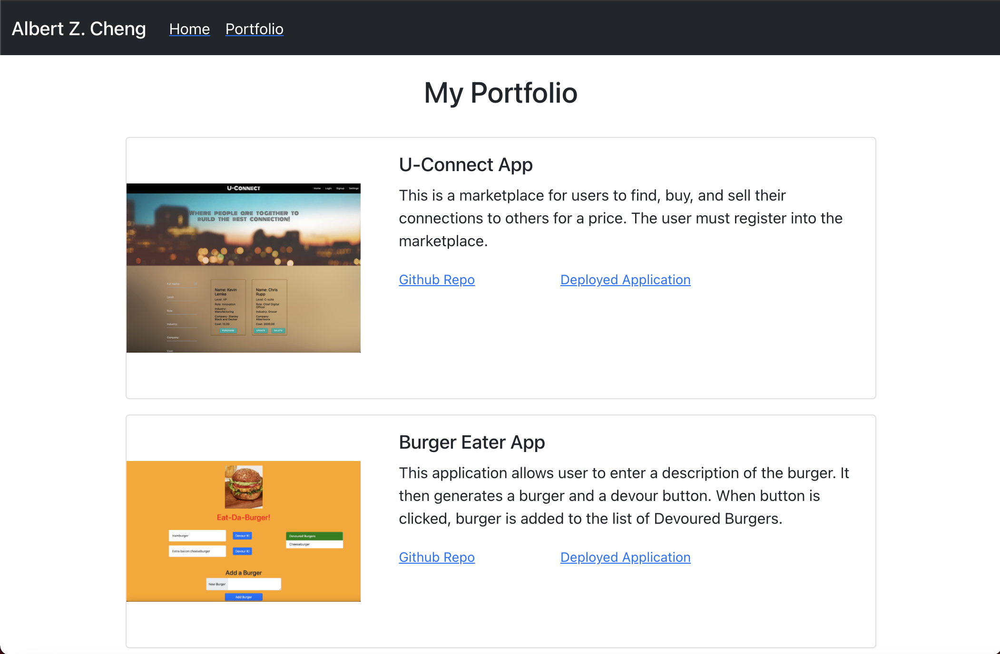

# My React Professional Porfolio 

## Description

I've created my portfolio page that has an About page and a Portfolio page. 

## Technologies Used
* HTML 
* CSS
* Bootstrap
* React
* React-router-dom

## About Page
### Screenshot of page

### Features 

This page has the following sections: 
* The About Me section gives my bio 
* The Contact Info section has the following: 
   * My full name
   * My email 
   * My phone number
   * My LinkedIn URL
   * A link that is used to download my resume

## Portfolio Page
### Screenshot of page

### Features 

This page has a section for each of my projects.  These projects have a Github Repo link and a Deployed Applcation link for audience to click to the respective repo and application. 

## Link to Portfolio

[Click Here to go to my portfolio.](https://react-portfolio-515.herokuapp.com/)